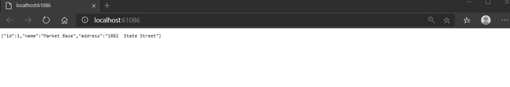
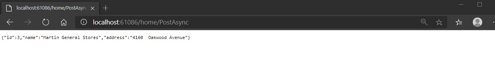

# Tareas del MOC

## Module 13: Implementing Web APIs

# Lesson 3: Calling a Web API 

### Demonstration: How to Call Web APIs by Using Server-Side Code

- En el Middleware añadimos la dependencia a httpclient 

- Creamos un controlador **HomeController**

  - Le añadimos el constructor con la dependencia httpclient
  - Añadimos la tarea httpget **GetByIdAsync** y la httppost **PostAsync**

- Y en el **launchSettings.html** cambiamos la opcion de que lance el browser

- Ejecutamos y comprobamos la salida

  

  

  

  /home/PostAsync

  

  

  

  
